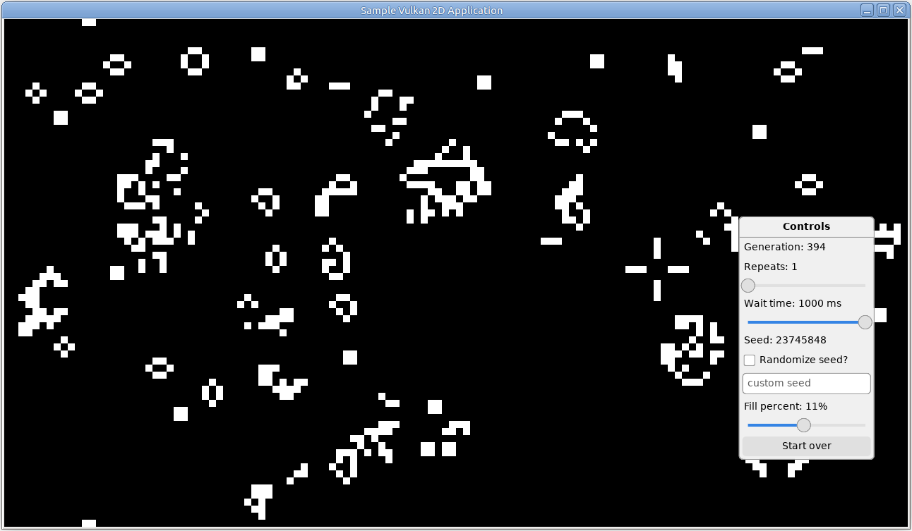

# Sample Vulkan 2D Application

Sample 2D application in Zig using `dvui`, Vulkan, and SDL3.



## Usage

### Installation
```bash
git clone https://github.com/mm318/vulkan-sdl3.git
```

### Build
All commands should be run from the project root.

To build:
```bash
zig build                           # for debug build
zig build -Doptimize=ReleaseSafe    # for release build (recommended)
```

To run:
```bash
zig build run
```

### Develop

To format the source code:
```bash
zig fmt .
```

To run the unit tests:
```bash
zig build test
```

## Requirements

Developed using Ubuntu 24.04 and Zig 0.16.0.
