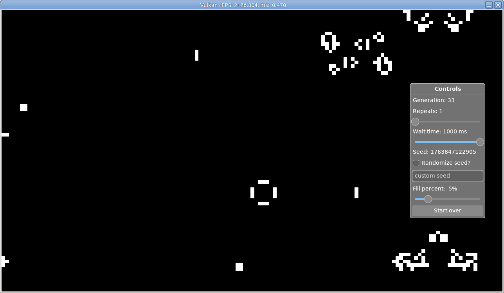

# Sample GPU Application

This app uses Zig and Vulkan in the backend (and SDL3 and DVUI for the frontend).



## Building and Running

To build and run the program:
```shell
zig build run                          # for debug build
# zig build -Doptimize=ReleaseSafe run # Dependencies have issues with ReleaseSafe
zig build -Doptimize=ReleaseFast run   # for release build
```

To build and run unit tests:
```bash
zig build test --summary all                        # for debug build
zig build -Doptimize=ReleaseSafe test --summary all # for release build
```

## Credits

This is a mix of the following sources put together:
- https://github.com/spanzeri/vkguide-zig
- https://github.com/Deins/s3-vk / https://github.com/Deins/dvui_vk
- https://codeberg.org/knightpp/game-of-life-zig
